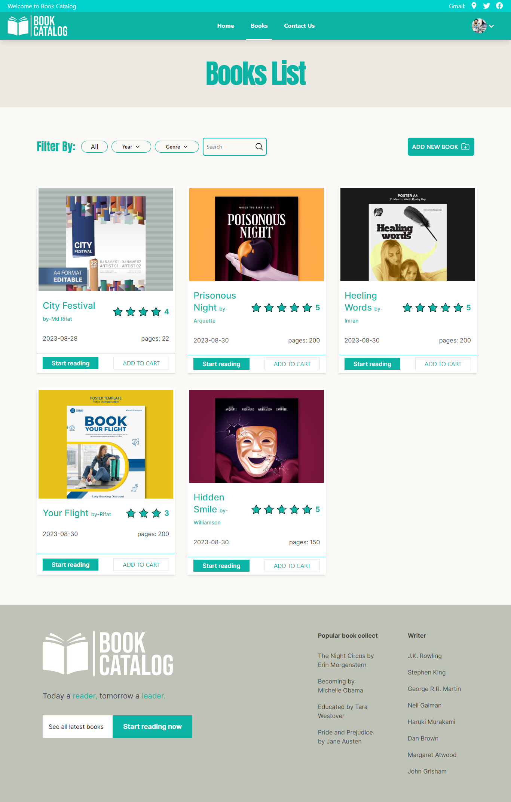

### Book Catalog Frontend


### Introduction

Welcome to the Book Catalog Frontend! This web application serves as the user
interface for the Book Catalog platform, where users can browse and discover
various books across different genres and authors.

The primary objective of this frontend application is to provide users with a
seamless and enjoyable experience while exploring the extensive collection of
books available in the catalog. It interacts with the Book Catalog API to fetch
and display book information, enabling users to search for books, view detailed
descriptions, and manage their reading lists effectively.

### Live Link:

```
https://bookscatalog.vercel.app
```


